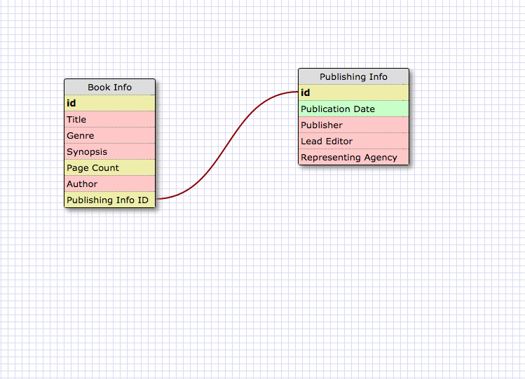
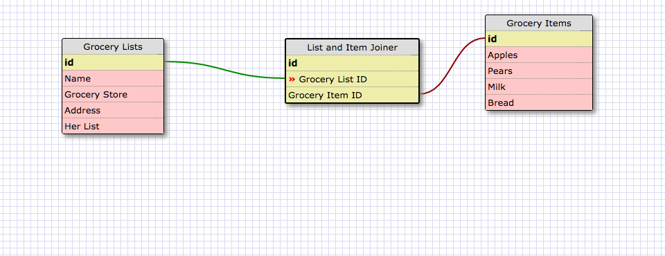

##What is a one-to-one database?
A one to one database is a pair of keys that each have one and only one relation.
##When would you use a one-to-one database? (Think generally, not in terms of the example you created).
You would use a one-to-one database anytime you need your information to be linked to only one set of information. This might include something like a database of married couples where each husband and wife(or really any combination of those) each has one and only one relative link.

##What is a many-to-many database?
A many-to-many database links objects that have many dynamic relationships between one another.
##When would you use a many-to-many database? (Think generally, not in terms of the example you created).
These could include any situation in which each table in the database has links to many instances of the other tables. This could mean something like student housing at a college. Each student lives in more than one room over their college carreer, and each room houses more than one student.

##What is confusing about database schemas? What makes sense?
I'm still a little confused about when I would actually need to use a one to one database, since it seems like many of the possibilites I could justify using a one to many database instead. Even with the husband-wife example earlier, if anybody had been remarried or polygamist, the whole structure is out the window. There doesn't seem to be any drawback besides speed to using a one-to-many

