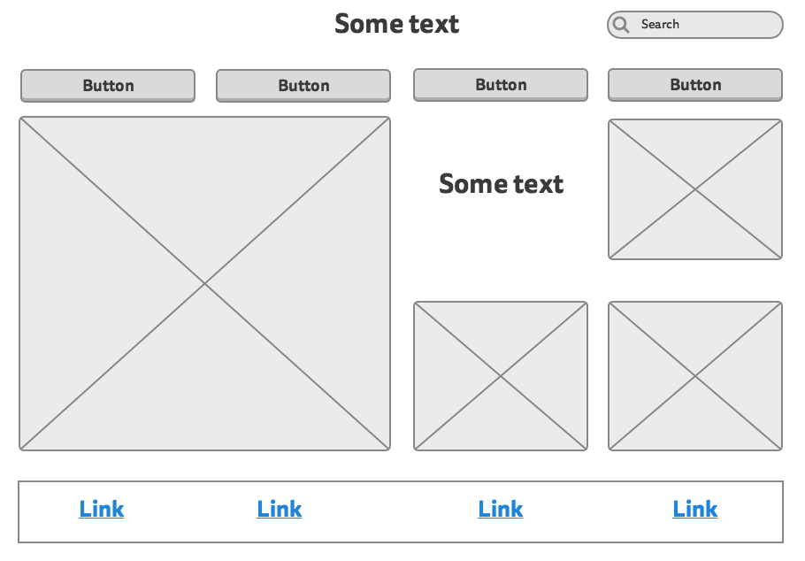
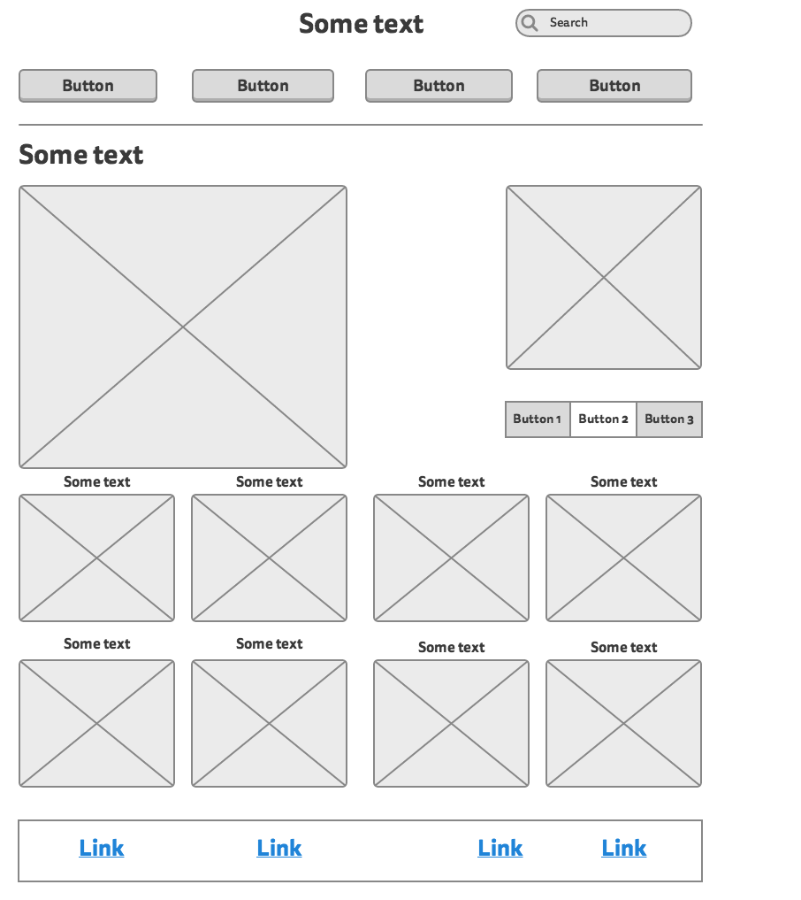

#What is a wireframe?
A wireframe is like the skeleton of a webpage. It's what you set up before putting any content, coding, or design into it. It's the basic structure of the website. It can be drawn by hand, created with software, or taken from a template, but however its made, it's there to act as a foundation on which the website is built.

#What are the benefits of wireframing?
Wireframing helps you visualize the site so that once you want to work on it, you can simply place your content and assets directly into their predetermined position. Not only does it streamline the process, but it helps designers visualize the completed website to make incorporating those elements and tailoring them to the website even simpler.

#Did you enjoy wireframing your site?
I enjoyed watching the pieces come together, but I tend to struggle with this kind of visual design. I can sometimes find myself unable to visualize the finished project, so, in that way wireframing was both difficult and ultimately rewarding. I wish I were more satisfied with the end result, but it was my first try, so I will try to stay positive.
#Did you revise your wireframe or stick with your first idea?
I revised the wireframe a few times, and I was never 100% satisfied with how it came out. Once I started using mockingbird and wirify, it helped me visualize the process and brought my frame more inline with how I imagined it.

#What questions did you ask during this challenge? What resources did you find to help you answer them?

My biggest question was probaby "What is a professional website *supposed* to look like?" I checked out a lot of different examples and wirified them, but I couldn't get a firm grasp on what elements were necessary and where everything should go. I eventually made some decisions, but I'm a little dissatisfied with the results.

I also found myself wondering what elements I should put on the front page, rather than save for a page like about or content, but I eventually decided that I could worry about that once I got to adding content. I have the template for each already, since mockingbird makes it really easy to create and copy wireframes, so I don't really need to sweat it just yet.

#Which parts of the challenge did you enjoy and which parts did you find tedious?
I enjoyed watching the project come together, but I found the visualization a little tedious. I imagine some people are able to picture what they want the website to look like in their head, but I had to check out a ton of blogs, professional websites, and templates before I had a good sense of what my website was supposed to look like.