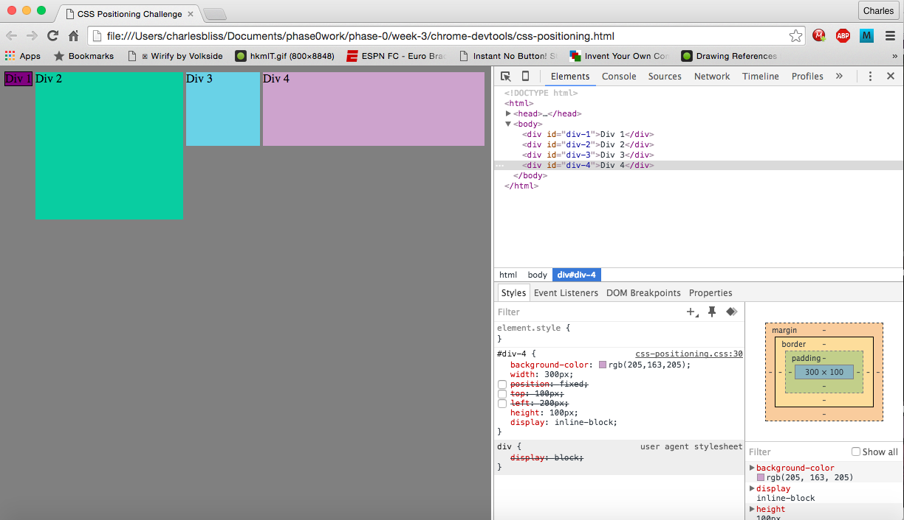

#How can you use Chrome's DevTools inspector to help you format or position elements?

The inspector is great for being able to view changes on the fly. As soon as you input, you can see the results, which is a huge timesaver. It's a whole lot easier than refreshing every time you make a change or multiple changes just in case something doesn't work out. (Which is often, so far.)
#How can you resize elements on the DOM using CSS?
  You can manipulate the width and height of any div directly, just by entering width/height:dimensions.
#What are the differences between absolute, fixed, static, and relative positioning? Which did you find easiest to use? Which was most difficult?
The position:property was probably the one I struggled most with, since I felt like I understood the difference, but it never quite worked out the way I wanted in practice. The wording is also strange to me, since I feel like I have the opposite vocabulary as the CSS devs. When I scroll, I feel like I am moving, not the web page, so fixed and absolute take on opposite meanings for me. I know that absolute technically moved with the page,and fixed doesn't move with the page, but I feel like absolute is staying still while fixed is moving with me. Relative positioning is defined by other divs or elements on the page, and static is the same as defining no position, meaning it will show up in the order placed by its location in the HTML.
#What are the differences between margin, border, and padding?
Margin, border, and padding are all similar in that they act as buffers between different elements on the page. The distinction I was able to get from completing this and my solo challenge was that padding acts as part of the element itself, while a margin goes outside the element in order to create space, and a border acts as a line between the two. Generally a border will be visible,so using padding can create space between a text object or image and a border, while a margin can create space between that border and the rest of the page.
#What was your impression of this challenge overall? (love, hate, and why?)
I liked this challenge a lot, since it got me direct and immediate feedback on the commands and properties I was putting in. As a result, I learned a lot more than in the first pairing session this week, where I felt like everything was basically trial and error. Honestly, I wish that I had done this activity first, since I would have been able to implement a lot of what I learned and maybe not felt as frustrated during the first pairing session.